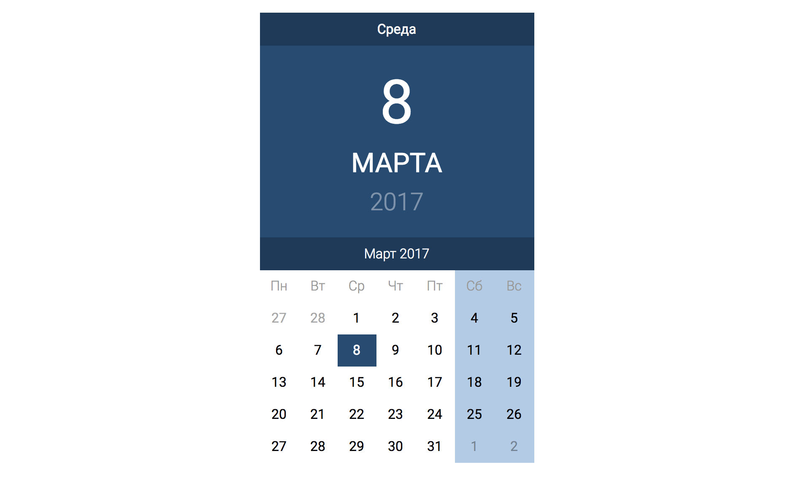

Календарь
===

Создан React-компонет Calendar (функциональный компонент), который показывает текущую дату и текущий месяц, как показано на картинке:

Для реализации проекта использовалась библиотека [Moment.js](https://momentjs.com/)

## Установка и запуск приложения на локальной машине:
1. `git clone https://github.com/IrinaSakhno/components.git` - клонировать репозиторий на свое устройство
2. `cd calendar` - перейти в папку calendar
3. `npm i` - установить зависимости
4. `npm run start` - запустить приложение в режиме разработчика

После этого приложение можно будет открыть по ссылке  [http://localhost:3000](http://localhost:3000) в Вашем браузере.
